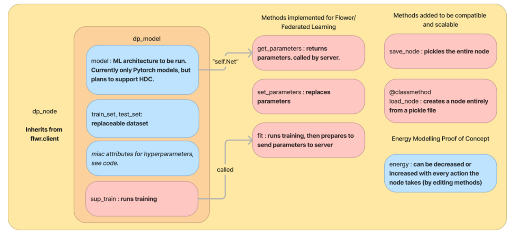
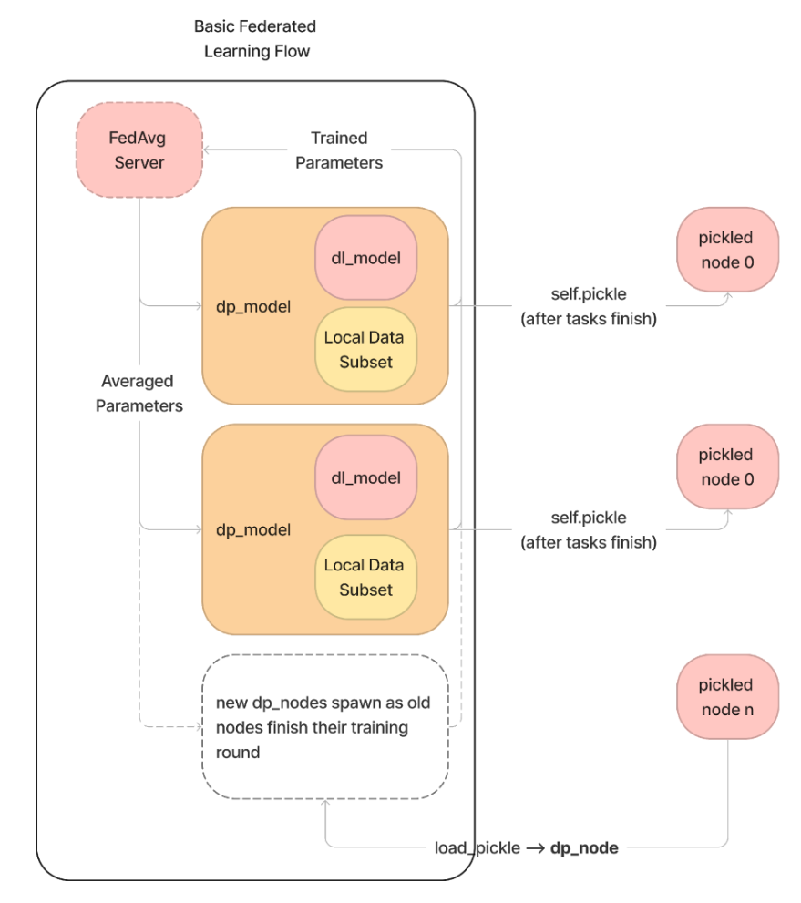

# CIDR Distributed Learning Framework (a.k.a. WSN-DL)

Under the CIDR P3 project, this framework was built to quickly perform experiments on efficient ML algorithms for distributed learning applications.

We built this framework with examples for the 4 MLPerfTiny tasks as outlined in the table below.

| Task                                         	| MLPerfTiny Prescribed  Model                             	| MLPerfTiny Target Performance 	| Single-node performance with  default hyperparameters 	|
|----------------------------------------------	|----------------------------------------------------------	|-------------------------------	|-------------------------------------------	|
| Visual Wakewords                             	| MobileNet (v1)                                           	| 0.80 (top-1)                  	| 0.91                                      	|
| Keyword Spotting (Hello Edge Ver.)           	| DS-CNN (Hello Edge)                                      	| 0.90 (top-1)                  	| 0.94                                      	|
| Image Classification (CIFAR-10)              	| 3-Block ResNet                                           	| 0.85 (top-1)                  	| 0.87                                      	|
| Anomaly Detection (DCASE 2020 Task 2 ToyCar) 	| Fully-connected Autoencoder (DCASE 2020 Task 2 Baseline) 	| 0.85 (AUC)                    	| 0.89                                      	|

Current version has support for:

1. Centralized training (like normal, as opposed to federated training) for all MLPerfTiny tasks. See `solo_train_scripts`.
2. Federated training (see `runme_<task>.py` files) for all MLPerfTiny tasks.
3. Simple notebook demonstrating how the project is used and how to setup the config file (`federated_demo.ipynb`). This should work in google colab, albeit very slowly.

## Models in this repository


## Workspace Setup and Dependencies

To install the setup and dependencies, make sure to download a conda distribution for your OS [here](https://conda.io/projects/conda/en/latest/user-guide/install/index.html). For faster dependency solving, I recommend the miniforge/mamba version which [can be downloaded here](https://github.com/conda-forge/miniforge).

<details><summary> For setup in UP Microlab's RHEL PCs do these to install mamba/conda </summary>

You must install miniforge3 (or conda) without the use of `sudo` or `root`. Here is how to do that:

1. Go to [GitHub - conda-forge/miniforge: A conda-forge distribution.](https://github.com/conda-forge/miniforge#download)

2. Copy the link of the linux x86 version (Right click Download Link > `Copy Link`)

3. In your local terminal (tcsh in the ulab PCs) do `wget <linkhere>` to get the **miniforge** installer
4. Do `bash Miniforge3-___-___` to install **miniforge.** Should take a few minutes.
5. (4) Should have created a .bashrc file in your home folder (~). To be able to see pwd in this, add `PS1=’\w\$ ‘` as the first line of your .bashrc file.
6. Open `bash`. This is because the default terminal of microlab is tcsh (do `echo $SHELL` to see),  but conda/mamba only works with bash.
7. Do `mamba --version` to test mamba

</details>

After cloning this repository go into the directory `cd cidr-ufl`. 

Then, do `conda env create -f wsn-dl.yml`. This will take a while.

After the installation finishes, you should now have all the dependencies and can now try things from the `solo_train_scripts` folder. Note: **you need to have the datasets downloaded, so set `download=True` for `ic.py` so at least that works.**

See below for instructions on downloading each dataset.

## Getting started

To use the framework, follow the instructions in the `federated_demo.ipynb` notebook. 

## Replacing parts of model

`dp_model.model` is a Pytorch model object- simply replace it with another Pytorch model (i.e. the one that can call model.forward())

To change the training environment and hyperparameters, the `optimizer, criterion, scheduler, learning_epochs` attributes of the `dp_model` object can be replaced, as per their Pytorch values.

To change the dataset, simply (1) replace the `train_set` and `test_set` attributes of `dp_model` with your desired Pytorch dataset object (must be of type TorchDataset) and (2) run `dp_model.load_loaders()`

## Anomaly Detection Dataset

The base anomaly detection dataset is from DCASE2020 Task 2's ToyCar dataset given as `.wav` files in their website.

You must create a new folder "`<path_to_data_dir>/Toycar_test`" in the data folders, where you need to create two folders: `<path_to_data_dir>/Toycar_test/anomaly` and `Toycar_test/normal`.

Run the following commands to set the folders up:

```bash
$ cp -s <path_to_data_dir>/ToyCar/test/anomaly* <path_to_data_dir>/ToyCar_test/anomaly
$ cp -s <path_to_data_dir>/ToyCar/test/normal* <path_to_data_dir>/ToyCar_test/normal
```

To preprocess the wav data for use in the model, `anomaly_detection.toycar` provides loading functions to load these as torch datasets (after turning them into Log Mel Spectrograms as per the DCASE2020 Task 2's preprocessing instructions), so long as you point the functions to the correct data folder after downloading.

To get the Pytorch datasets, simply do the following in your code:

```python
from anomaly_detection import toycar

train_set = toycar.get_trainset()
test_set = toycar.get_testset()
```

## Keyword Spotting Dataset

The keyword spotting dataset used here is the `SPEECHCOMMANDS` dataset from `torchaudio.datasets`.

Simply import that and set `download=True` to obtain a folder of the dataset, then set our code's path to that folder.

## Visual Wakewords Dataset

For VWW, you can use [`pyvww`](https://github.com/Mxbonn/visualwakewords) to download the MSCOCO dataset and turn it into the Visual Wake Words dataset. This will create a folder containing symbolic links to the correct images, which you can then set as path for our code.

## Framework Operation

In the framework, nodes can be designed by inheriting from a base class
`dp_node`. This class contains a `dp_model` object, which contains the AI model itself, its
training and evaluation set, and other miscellaneous parameters. Basically, to create a
new node, you must instantiate a `dp_node` object. To replace the AI model inside, you
must create and instantiate a new `dp_model`.

(Figure 1. Structure of a node from the WSN-DL Framework)

In the CIDR DL framework, the main function initializes the simulation and
spawns both the server and the nodes. The nodes each contain its own local data
subset to sample from, and an ML model to train.

(Figure 2. WSN-DL Framework Operation)

The server periodically requests a subset of the nodes to send their parameters
(**trained parameters** on Figure 2) using the `get_parameters` function from Figure 1.
When the server does this is entirely dependent on the currently implemented
server-side algorithm. In our sample implementation, the server-side algorithm is
FedAvg. In FedAvg, the nodes send their parameters every L training epochs, known as
the “local epochs”. This does not mean that the nodes need to finish all their epochs at
the same time. Rather, the only valid nodes for a parameter sampling round will be ones
that have finished all of the epochs.

After the server obtains the parameters, it aggregates the parameters according
to the server-side algorithm, then it sends it back to all the nodes (averaged parameters
in Figure 2) using the set_parameters function of the node in Figure 1.

