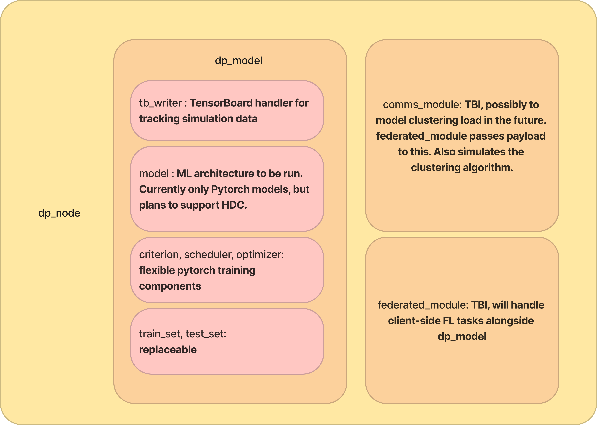

# CIDR Distributed Learning Framework

Under the CIDR P3 project, this framework is being built to quickly perform experiments on efficient ML algorithms for distributed learning applications.

We have sample support for 



## Getting started

To use the framework, instantiate an ML model:

```python
import cidr_node

my_model = cidr_node.dp_model()
```

By default, this instantiates a mobilenetv2 model with a fully-connected layer as its classifier with the CIFAR10 dataset.

To run supervised training, do

```python
my_model.sup_train()
```

To test the model on the current lodaded , do

```python
my_model.test()
```

To quantize the model using post-training quantization, do

```python
my_model.quantize()
```

## Visual Wakewords

An example of using the framework to run model training on visual wakewords in provided in `main_quantize.py`

## Replacing parts of the model

`dp_model.model` is a Pytorch model object- simply replace it with another Pytorch model (i.e. the one that can call model.forward())

To change the training environment and hyperparameters, the `optimizer, criterion, scheduler, learning_epochs` attributes of the `dp_model` object can be replaced, as per their Pytorch values.

To change the dataset, simply (1) replace the `train_set` and `test_set` attributes of `dp_model` with your desired Pytorch dataset object (must be of type TorchDataset) and (2) run `dp_model.load_loaders()`

## Distributed Learning

The cidr-ufl framework simulates distributed learning using Flower as a backend. To run a sample federated simulation on CIFAR10, run

```
python federated_module.py
```

This simulation may take very long for high numbers of clients. To change the number of clients, edit the file `config.py` from which all other code files take global parameters.

To edit the AI model or anything about the node, create a new node inheriting from the parent `dl_node` class like follows:

```python
# Borrow global GPU/CPU from config.py
import config
device = config.device

class my_node(dl_node):

    # You just need to redefine __init__; 
    # Everything else is inherited from dl_node

    def __init__(self):
        self.dp_model = cidr_node.dp_model()
        self.dp_model.model = <some_pytorch_model>.to(device) 

        # must set optimizer to target new model
        self.dp_model.optimizer = <some_pytorch_optimizer>(
            self.dp_model.model.parameters()
        )

        self.dp_model.train_set = <some_torch_dataset>
        self.dp_model.test_set = <some_torch_dataset>

        # create dataloaders from the datasets
        self.dp_model.load_loaders

node = my_node()
my_node.train()
```

Do not just change the model of an existing node, since `Flower`'s `client_fn` has trouble keeping track of the model changes.

## Anomaly Detection Dataset

The base anomaly detection dataset is from DCASE2020 Task 2's ToyCar dataset given as `.wav` files in their website.

You must create a new folder "`<path_to_data_dir>/Toycar_test`" in the data folders, where you need to create two folders: `<path_to_data_dir>/Toycar_test/anomaly` and `Toycar_test/normal`.

Run the following commands to set the folders up:

```bash
$ cp -s <path_to_data_dir>/ToyCar/test/anomaly* <path_to_data_dir>/ToyCar_test/anomaly
$ cp -s <path_to_data_dir>/ToyCar/test/normal* <path_to_data_dir>/ToyCar_test/normal
```

To preprocess the wav data for use in the model, `anomaly_detection.toycar` provides loading functions to load these as torch datasets (after turning them into Log Mel Spectrograms as per the DCASE2020 Task 2's preprocessing instructions), so long as you point the functions to the correct data folder after downloading.

To get the Pytorch datasets, simply do the following in your code:

```python
from anomaly_detection import toycar

train_set = toycar.get_trainset()
test_set = toycar.get_testset()
```

